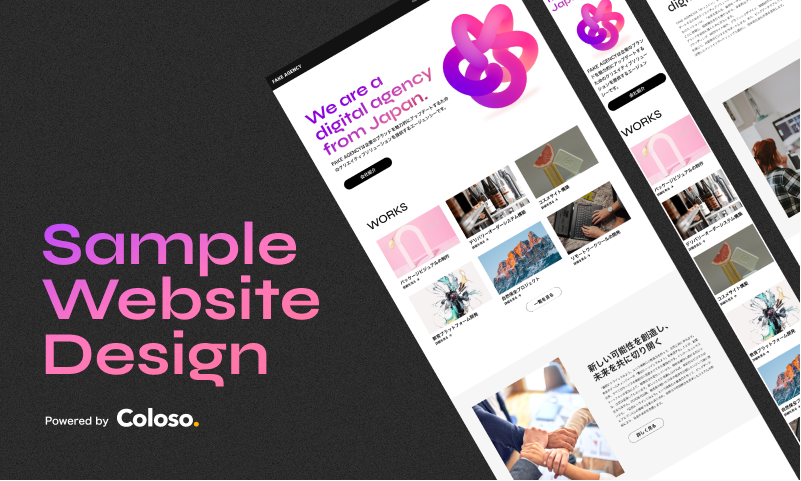

講座用サイトデザインの説明
===

- この講義では今回マークアップを行う対象のデザインファイルを確認していきます。
- デザインファイルはFigmaで作成しています。このフェーズではデザインファイルを確認しつつどう実装していくかを考えます。

## Figmaについて

[Figma](https://www.figma.com/ja/)

Figmaとは、ウェブサイトやモバイルアプリケーションなどのデジタルプロダクトの画面設計やプロトタイピングに加え、チームなど複数人で共同編集できるコラボレーション性に特化した、クラウドベースのデザインツールです。

Figmaにはいくつもの良い点がありますが、ここでは個人的に好きな点を紹介します。

- 敷居の低さ
  - 機能制限はありますが、1人で使ったりお試しに使う場合であれば無料で利用できます。
- クラウドベース
  - Figmaはクラウド上で動作するため、インストール不要で様々なデバイスからアクセスできます。どの端末でも同様のデザインを確認することが可能です。
- コンポーネント
  - 作成したデザインデータのうち、複数の画面などで共通部品として使用するUIを、再利用可能なコンポーネントとして公開できるライブラリ機能が提供されています。これによりデザイナーや開発者は共通のコンポーネントを意識せずに使えます。
- プラグイン
  - Figmaはプラグインのエコシステム（Community機能）を持っており、開発者が作成したプラグインを利用することで、デザインプロセスをカスタマイズできます。
- コラボレーション
  - 複数の人が同時に作業でき、リアルタイムで編集が反映されるため、リモートワークやチームでのデザイン作業に最適です。
- バージョン管理
  - 過去のバージョンに戻ったり、変更の差分を確認したりできるため、プロジェクト管理がしやすいです。

### Figmaの使い方

この講座では詳しい説明は省きますが、Figmaの使い方については講座や本、ブログなどが各種用意されています。

- [Figmaデザイン入門〜UIデザイン、プロトタイピングからチームメンバーとの連携まで〜 | 綿貫 佳祐 |本 | 通販 | Amazon](https://amzn.asia/d/0kJSPyb)
- [UI/UXデザイナー 成塚雅樹 | Coloso. | コロソ.](https://coloso.jp/visualcommunication/uxuidesigner-narizuka-jp)
- [Figma | wentz-design.com](https://wentz-design.com/tags/figma/)

## デザインデータの説明

講座用に作成したデザインデータを確認していきます。

### `.fig`ファイルの開き方

配布された`.fig`ファイルは[Figmaへのファイルのインポート](https://help.figma.com/hc/ja/articles/360041003114-Figma%E3%81%B8%E3%81%AE%E3%83%95%E3%82%A1%E3%82%A4%E3%83%AB%E3%81%AE%E3%82%A4%E3%83%B3%E3%83%9D%E3%83%BC%E3%83%88)を参考に開いてください。
